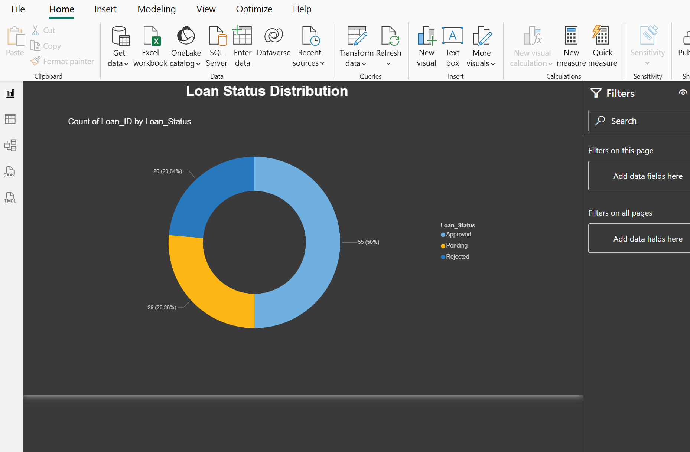

# POWER-BI-DASHBOARD 📊💼

Interactive Power BI dashboard for financial data analysis, KPI tracking, trend visualization, and business performance reporting.

---

## 🖥️ Full Dashboard Preview

Here is the complete visualization of the interactive financial dashboard:

---

## 🔍 Key Performance Indicators (KPIs) & Insights

This project breaks down complex financial data into specific, actionable metrics:

### 📈 Metrics & Performance Tracking
| Analysis Focus | View Screenshot |
| --- | --- |
| **Core KPIs Overview** |  |
| **Average Credit Score** |  |

### 🎯 Loan Analysis & Risk Assessment
| Analysis Focus | View Screenshot |
| --- | --- |
| **Loan Status Tracking** |  |
| **Risk Level Assessment** |  |
| **EMI Ratio Analysis** |  |

---

## 🛠️ Features
* **Financial Data Analysis:** Deep dive into credit metrics, EMIs, and performance tracking.
* **KPI Tracking:** Clear and concise high-level visual summaries for stakeholders.
* **Trend Visualization:** Visualizing loan distributions and risk allocations across consumer profiles.

---

## 📜 License
This project is licensed under the MIT License - see the [LICENSE](LICENSE) file for details.
